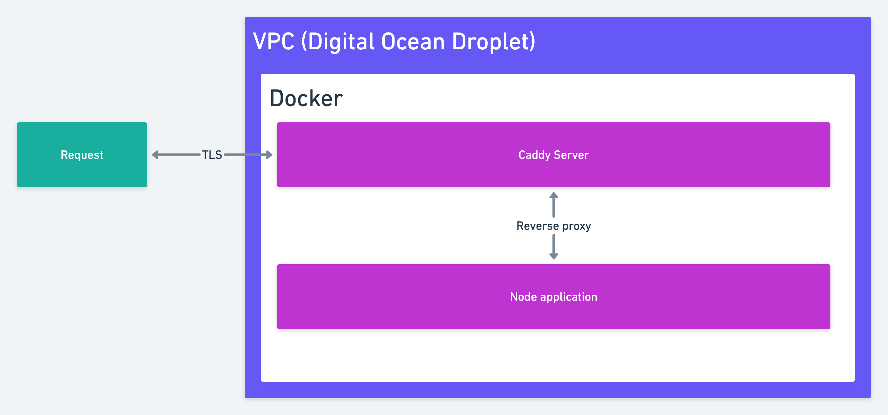

# Deploy Node.js application with Caddy, Docker & docker-compose on DigitalOcean

## Why Caddy?
* Automatic TLS (SSL/ HTTPS)
* Easy configuration

1.0 Configure Docker & Caddy Server

    1.1 Create Dockerfile
    1.2 Create docker-compose.yml file
    1.3 Create Caddyfile
    1.4 Create deploy script

2.0 Create Digital Ocean Droplet

3.0 Point domain at droplet

4.0 Deploy application

    4.1 SSH in to server
    4.2 Git pull repo `git clone https://github.com/TomDoesTech/caddy-nodejs-docker-tutorial.git`
    4.3 Run deployment script

5. Test SSL certificate
`https://www.ssllabs.com/ssltest/`

Notes:
On Mac OS you need to mode the deployment script to execute it
`chmod +x deploy.sh`

YouTube video with step-by-step explanations: https://www.youtube.com/watch?v=2oNsjyaCIrI

## Let's keep in touch
- [Subscribe on YouTube](https://www.youtube.com/TomDoesTech)
- [Discord](https://discord.gg/4ae2Esm6P7)
- [Twitter](https://twitter.com/tomdoes_tech)
- [TikTok](https://www.tiktok.com/@tomdoestech)
- [Facebook](https://www.facebook.com/tomdoestech)
- [Instagram](https://www.instagram.com/tomdoestech)

[Buy me a Coffee](https://www.buymeacoffee.com/tomn)

[Sign up to DigitalOcean 💖](https://m.do.co/c/1b74cb8c56f4)
